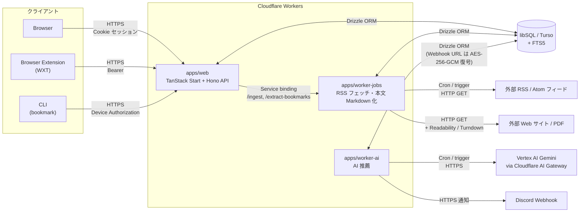

# bookmark-rss

RSS リーダーとブックマークマネージャを 1 つにしたパーソナル Web アプリ。記事は Markdown に正規化されて検索・閲覧でき、ローカル AI が「今日のおすすめ」を選んで Discord にも通知できる。Cloudflare Workers 上で動作する。

## 主な機能

- **RSS / Atom フィード購読**
  - カテゴリ分け、未読 / 既読管理、一括既読
  - OPML インポート
  - サイドバーにカテゴリ別フィード一覧（カテゴリごとに折りたたみ可、状態は LocalStorage で永続化）
- **ブックマーク管理**
  - URL を渡すと Mozilla Readability + Turndown で本文を Markdown 化
  - PDF は自動検出してプレースホルダー Markdown に置換
  - タグ機能
  - SQLite FTS5 による全文検索
- **AI による「今日のおすすめ」**
  - Vertex AI Gemini を Cloudflare AI Gateway 経由（BYOK）で呼び出し
  - 任意で Discord Webhook に通知（Webhook URL は AES-256-GCM で DB に暗号化保存）
- **ブラウザ拡張**（Chrome / Firefox、WXT ベース）でワンクリック追加
- **CLI**（`bookmark` コマンド）でデバイス認可フロー経由のブックマーク操作
- ダークモード / セピアテーマ、レスポンシブ（モバイル・iPad 対応）、退会処理

## 構成

5 つのアプリと 5 つの共有パッケージから成るモノレポ（pnpm workspaces + Turborepo）。

```
bookmark-rss/
├── apps/
│   ├── web/                       # TanStack Start アプリ (Cloudflare Workers)
│   ├── extension/                 # WXT ベースのブラウザ拡張 (Chrome / Firefox)
│   ├── cli/                       # `bookmark` CLI (tsdown でバンドル, Node 実行)
│   ├── worker-jobs/               # Cron / 内部 API ジョブワーカー (Cloudflare Workers)
│   │                                — RSS フェッチ, 本文 Markdown 抽出, FTS 更新
│   └── worker-ai/                 # AI 推薦ワーカー (Cloudflare Workers, Vertex AI Gemini)
├── packages/
│   └── api/                       # Hono ベースの API ルータ (@acme/api)
│                                    — フィード取得, Markdown 抽出, AI 推薦
├── tooling/                       # 共有設定 (eslint, prettier, tailwind, typescript, github)
└── .datastore/                    # ローカル Turso の SQLite ファイル置き場
```

## データフロー



## セットアップ

### 前提条件

- Node.js
- pnpm
- Turso CLI

### 1. 環境変数

`.env.example` をコピーして `.env` を作成し、値を埋める。

```sh
cp .env.example .env
```

主な変数:

| 変数                                                            | 用途                                                                                     |
| --------------------------------------------------------------- | ---------------------------------------------------------------------------------------- |
| `DATABASE_URL` / `DATABASE_AUTH_TOKEN`                          | libSQL (Turso) 接続先。ローカルは `http://127.0.0.1:8080` / `local`                      |
| `BETTER_AUTH_URL` / `BETTER_AUTH_SECRET` / `BETTER_TRUSTED_URL` | Better Auth。`BETTER_AUTH_SECRET` は `openssl rand -hex 32` などで生成                   |
| `AUTH_GOOGLE_ID` / `AUTH_GOOGLE_SECRET`                         | Google OAuth クライアント（Google Cloud Console で作成）                                 |
| `BOOKMARK_API_URL`                                              | CLI から叩く API ベース URL                                                              |
| `VITE_API_BASE_URL`                                             | 拡張機能から叩く API ベース URL                                                          |
| `ENCRYPTION_MASTER_KEY`                                         | Discord Webhook URL を AES-256-GCM で暗号化する 32 バイト鍵（`openssl rand -hex 32`）    |
| `GCP_PROJECT_ID` / `VERTEX_AI_LOCATION` / `VERTEX_AI_MODEL`     | AI 推薦で使う Vertex AI Gemini                                                           |
| `CF_ACCOUNT_ID` / `CF_AI_GATEWAY_ID` / `CF_AI_GATEWAY_TOKEN`    | Cloudflare AI Gateway。SA 鍵は Cloudflare ダッシュボードに登録するため、ここには置かない |
| `WEB_BASE_URL`                                                  | Discord embed のリンク先                                                                 |

本番デプロイ用の値は `.env.prod` に書く（`.gitignore` 済み）。

### 2. ローカル DB (Turso) の起動

別ターミナルで以下を実行し、ローカル libSQL サーバを `http://127.0.0.1:8080` で起動する。

```sh
turso dev --db-file .datastore/db.sqlite
```

DB ファイルは `.datastore/db.sqlite` に永続化される。

### 3. 依存パッケージのインストール

```sh
pnpm install
```

### 4. DB スキーマの反映

マイグレーションファイル生成:

```sh
pnpm db:generate
```

Better Auth のスキーマを再生成したい場合:

```sh
pnpm auth:generate
```

ローカル DB へ反映:

```sh
pnpm db:push
pnpm db:apply-extras   # FTS5 トリガなど Drizzle で表現できない追加スキーマ
```

### 5. 開発サーバの起動

```sh
pnpm dev
```

`turbo watch dev` で全ワークスペースを起動。

- Web: <http://localhost:3000>
- worker-jobs: <http://localhost:8788>
- worker-ai: <http://localhost:8789>

`pnpm -F @acme/worker-jobs trigger` / `pnpm -F @acme/worker-ai trigger` で各ワーカーを手動キック可能。

## CLI

```sh
# ビルド
pnpm -F @acme/cli build
```

## ブラウザ拡張

```sh
# Chrome
pnpm -F @acme/extension dev
# Firefox
pnpm -F @acme/extension dev:firefox

# 本番ビルド
pnpm -F @acme/extension build:prod
pnpm -F @acme/extension zip:prod
```

## デプロイ (Cloudflare Workers)

ルートから一括デプロイ:

```sh
pnpm deploy:prod
```

これは内部的に以下を順に実行する。

```sh
pnpm -F @acme/worker-jobs deploy:prod
pnpm -F @acme/worker-ai   deploy:prod
pnpm -F @acme/web         cf-deploy:prod
```

- それぞれ `.env.prod` の値が `wrangler deploy --secrets-file ../../.env.prod` で Secrets として登録される
- Web → worker-jobs は Cloudflare Workers の Service binding 経由で呼び出す

本番 DB のマイグレーションは別途:

```sh
pnpm db:migrate:prod
pnpm db:apply-extras:prod
```
